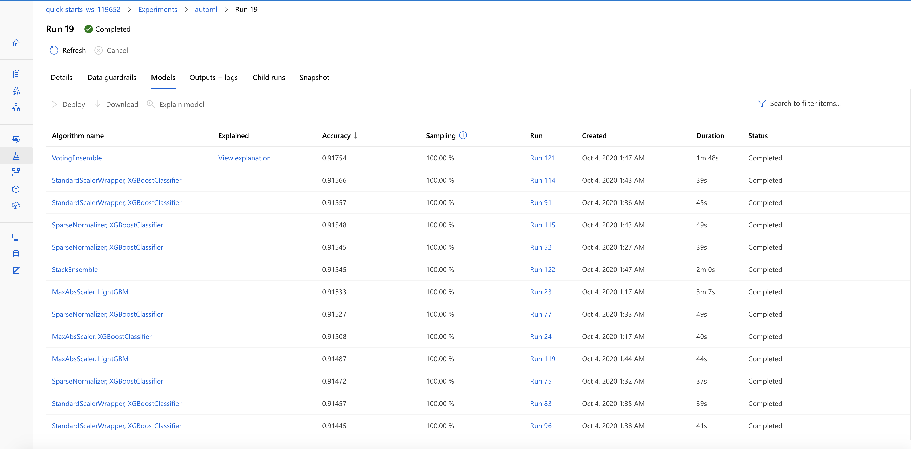

# Optimizing an ML Pipeline in Azure

## Overview
This project is part of the Udacity Azure ML Nanodegree.
In this project, we build and optimize an Azure ML pipeline using the Python SDK and a provided Scikit-learn model.
This model is then compared to an Azure AutoML run.

## Summary
The dataset contains data about the personal and financial details of the customers of a Portugese bank. We seek to predict if the customer will subscribe  to bank term deposit.

The best performing model was a Soft Voting Ensemble found using AutoML. It contained XGBoost Classifier with a standard scaler wrapper.

## Scikit-learn Pipeline
**Explain the pipeline architecture, including data, hyperparameter tuning, and classification algorithm.**
- The dataset is first retrieved using AzureDataFactory class.
- Some preprocessing steps were performed like converting categorical variable to binary encoding, one hot encoding 
- Then dataset is split in ratio of 67/33 (train/test)
- Then the model is trained using the hyperparameters passed from command line
- The hyperparameters that can be tuned are C an max_iter. C is the inverse regularization parameter and max_iter is the maximum number of iterations.
- Then accuracy was calculated on the test set which is also the defining metric.

**What are the benefits of the parameter sampler you chose?**
- The inverse parameter value C is one of the important parameters from business context and it controls the overfitting of the model. Normally a good thing is to see the change in accuracy by increasing or decreasing C by 10x
- The number of iterations is also an important factor because if the problem is too complex then they do help in training for longer durations.

**What are the benefits of the early stopping policy you chose?**
- It saves a lot of computational resources
- It saves a lot of time for the Data Scientist as we have clearly defined the patience level and the deviation that we can expect at maximum. 

## AutoML
**In 1-2 sentences, describe the model and hyperparameters generated by AutoML.**
AutoML was quite a surprise. I never knew it could run on so many models and so fast. The models were XGBoost, LightGBM, RandomForests, BoostedTrees, SGDClassifier with varying input preprocessing normalizations like: Min Max Scaling, Standard Scaling etc.
A complete list can be found here:

## Pipeline comparison
**Compare the two models and their performance. What are the differences in accuracy? In architecture? If there was a difference, why do you think there was one?**
The difference in accuracy is not too much. 
AutoML accuracy -> 0.9175
Hyperdrive accuracy -> 0.9135

In architecture AutoML was better because it tried a lot of different models, which was quite impossible if we have to do the same task with Hyperdrive because you have to create pipeline for every model.

There was not much in accuracy because of the data set but AutoML really computed some complex models which I was not even thinking to implement.

## Future work
**What are some areas of improvement for future experiments? Why might these improvements help the model?**
I would love to give my custom cross validation strategy for the future experiments. There was a lot of class imbalance problem, I am not sure how AutoML handeled that. 

## Proof of cluster clean up
**If you did not delete your compute cluster in the code, please complete this section. Otherwise, delete this section.**
The workspace terminated itself because I have been using is for 2 hours.